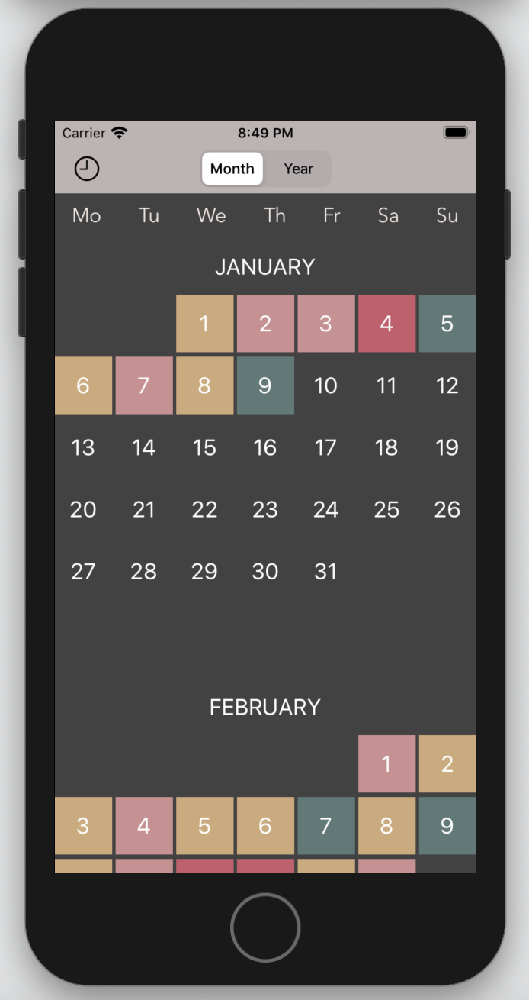
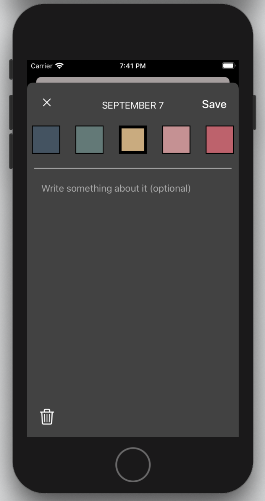
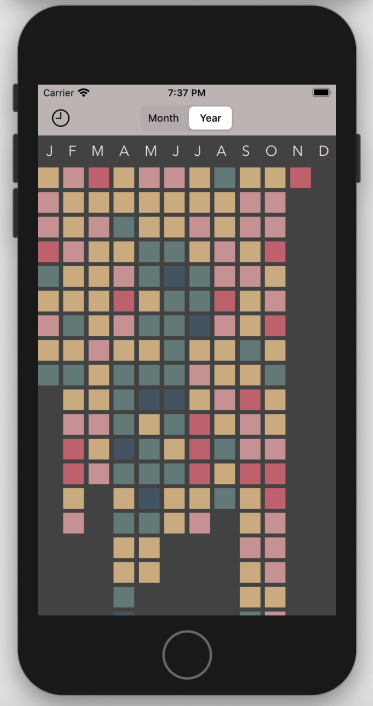
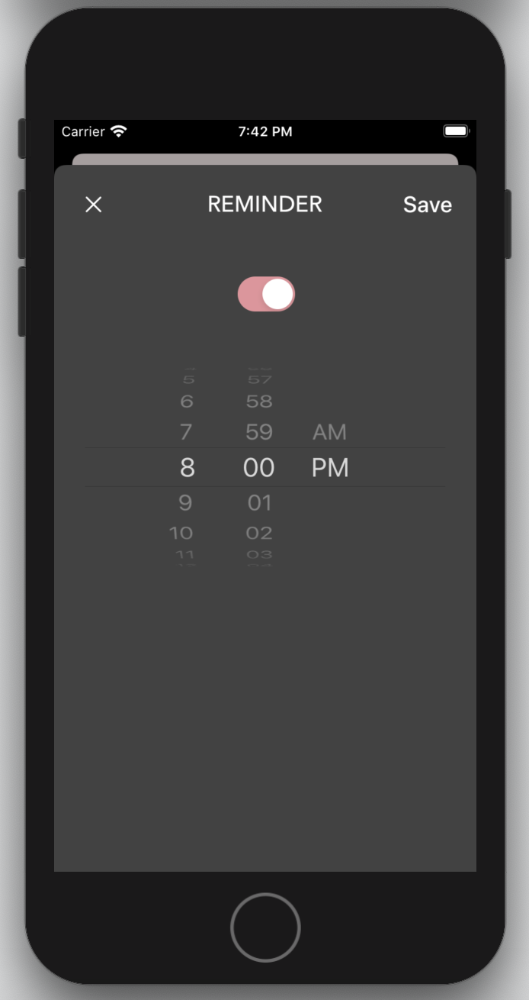

# YearInPixels

## An iOS app that allows you to easily track your mood every day of the year with colored pixels.
### Features:
* Add, edit, or remove the pixel for a given day
* Log your thoughts with notes
* See all of your pixels in a glance with **Year** mode
* Set a daily reminder to check in
* All data is saved locally on your device

### Built from scratch with Swift 5 and Xcode 11. No third-party libraries used.

### Lessons learned:
* Model-View-Controller design pattern is a must
* UIKit, *especially* how to manipulate UICollectionView
* Autolayout, stack views, and container views
* Local notifications and alerts
* Encoding and decoding data with the Codable protocol
* Persistence—both data persistence and just being persistent

### Screenshots:

